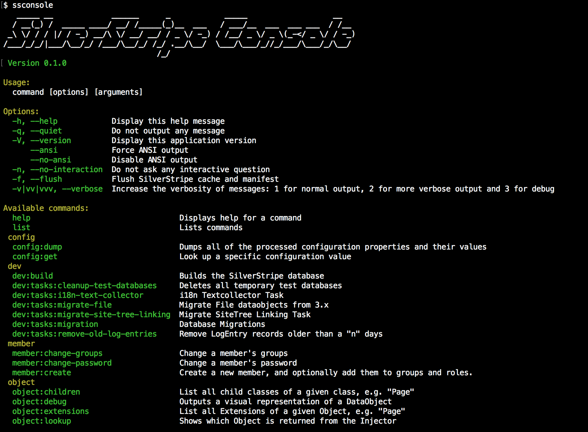

# silverleague/ssconsole

[](https://travis-ci.org/silverleague/silverstripe-console) [](https://scrutinizer-ci.com/g/silverleague/silverstripe-console/) [](https://codecov.io/gh/silverleague/silverstripe-console)

A useful command line interface for SilverStripe developers.



## Requirements

* PHP 5.6 or above
* SilverStripe 4.x or above
* Composer

## Installation

### With Composer

It is recommended to install this module globally with composer:

```shell
composer global require silverleague/ssconsole
$ ssconsole
```

Ensure your composer's `bin` folder has been added to your system path.

You can still require this module as a project dependency if you don't want to install it globally, of course:

```shell
composer require --dev silverleague/ssconsole
$ vendor/bin/ssconsole
```

### From source

If you wish to install this module from source, you can clone the repository and symlink `bin/ssconsole` into your system path, for example:

```bash
git clone git@github.com:silverleague/silverstripe-console.git
cd silverstripe-console
chmod u+x bin/console
ln -s "$(pwd)/bin/ssconsole" /usr/local/bin/ssconsole
```

## Usage

For detailed usage information, please [see the documentation](docs/en).

### Commands

To show the console menu and list of commands, run `ssconsole` from your terminal.

### Running commands

To run a command, choose the desired command from the menu and add it as an argument:

```shell
# Runs a task
ssconsole dev:tasks:cleanup-test-databases

# Builds the database and flushed the manifest/cache
ssconsole dev:build --flush
```

### Flushing the manifest

Sometimes you need to flush SilverStripe's manifest/cache while running CLI tasks. For example, if you've added a new `BuildTask`, but it doesn't show up in the SilverStripe console yet.

You can add the `--flush` option to any `ssconsole` command to instruct SilverStripe to flush and rebuild its manifest.

## Support

If you encounter a problem with our module then please let us know by raising an issue on our [issue tracker](https://github.com/silverleague/silverstripe-console/issues).

Ensure you tell us which version of this module you are using, as well as which versions of PHP and SilverStripe framework you are using. If you aren't sure, you can find out by running the following commands from your command line: `php -v`, `composer [global] show silverleague/ssconsole` and `composer show silverstripe/framework`.

## Roles

| Role          | Name                                              |
| ------------- | ------------------------------------------------- |
| Maintainer    | [robbieaverill](https://github.com/robbieaverill) |
| Co-maintainer | [robingram](https://github.com/robingram)         |
| Advocate      | [dmc-core](https://github.com/dmc-core)           |

## Contributing

Please see [the contributing guide](CONTRIBUTING.md) for more information.

## License

This module is licensed under the [MIT license](LICENSE.md).
